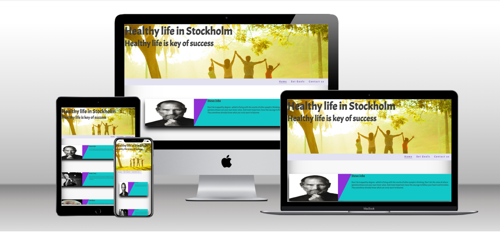
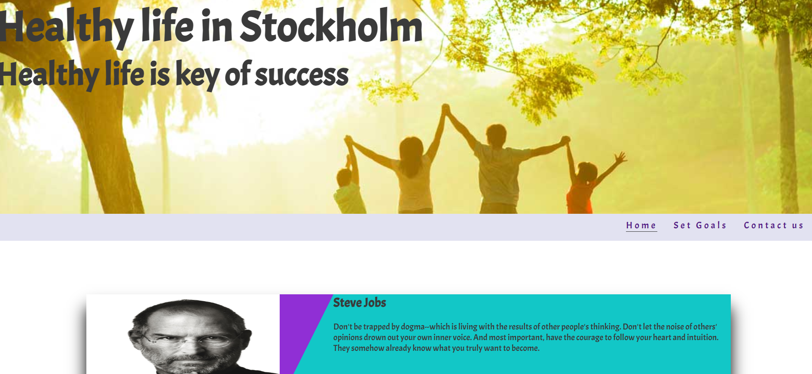
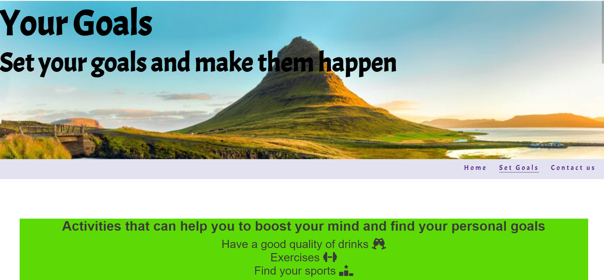
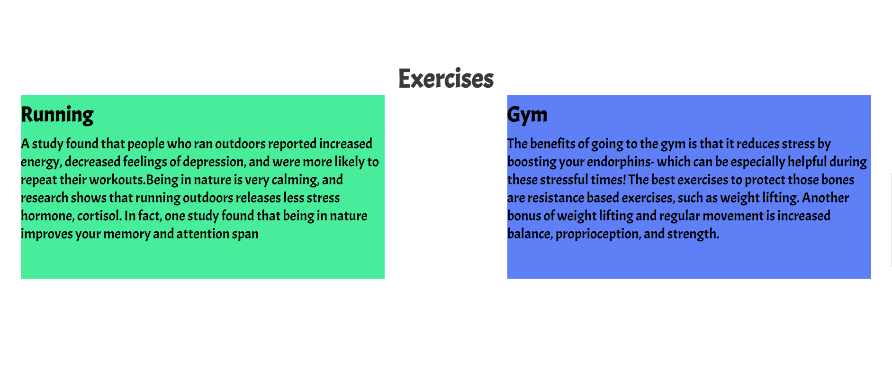
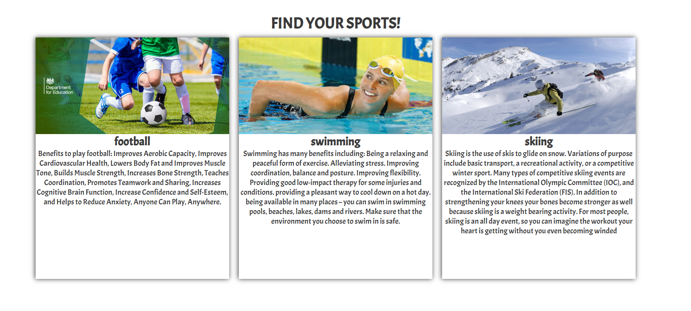
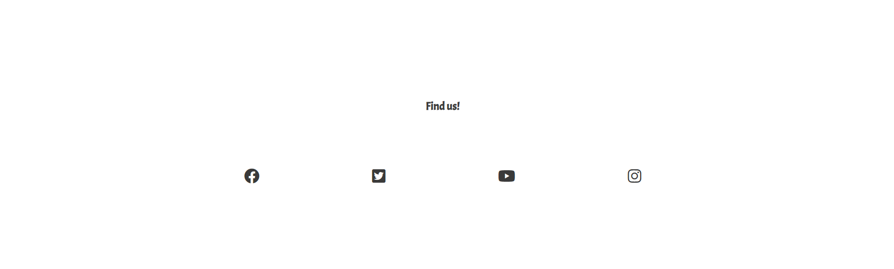
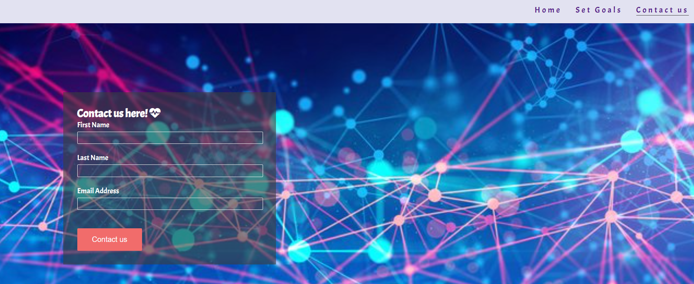

# Portfolio1 Project1

## First page and viewport for different devices.

## Representation of first page

First page contain;

1. A picture to give a inspiration for better life titled "good life in Stockholm"

2. Four most popular and important figures, represent powerful self development skills.

3. Navigation bar.

## Representation of second page

Second page contain;

1. A picture to inspire to set goals.

2. Navigation bar.

3. Represent some activity that can help to set main goals;

4. It's a good habit to have good drinks at the morning.

5. Second option is exercises. Represent two way to do exercises;

6. Third option is sports. Represent three types of sports;

## Footer

## Last page

1. This is a contact page where all of three element required;

2. Contain footer.

# Validator Testing

1. HTML
   No errors were returned when passing through the official W3C validator.

2. CSS
   No errors were found when passing through the official (Jigsaw) validator.

3. Accessibility

   

# Unfixed Bugs

I would like to give better position to all images. With images i could not do as I had expected, Because in the end of the project i realised; all images nested html file wasn't showing. I have to replace them inside stylesheet. It wasn't possible to contact tutor cause of short time. Accept my apologies.

# deployment

The live link can be found here - 

# content

1. Steve Jobs; (https://www.google.com/search?q=steve+jobs+speech+about+life&sxsrf=APwXEdcO7y6NV9DWvOF1pMr_q6CaqaudoQ%3A1688075419872&ei=m_ydZPflNKioxc8Pm72fyA4&oq=steve&gs_lcp=Cgxnd3Mtd2l6LXNlcnAQARgBMgQIIxAnMgcIIxCKBRAnMgcIIxCKBRAnMggIABCKBRCRAjIICAAQigUQkQIyCgguEIAEEBQQhwIyCwguEIAEEMcBENEDMgoILhCABBAUEIcCMgUILhCABDIFCC4QgAQ6CggAEEcQ1gQQsAM6BwgjEOoCECc6BwguEOoCECc6BwguEIoFEEM6BwgAEIoFEEM6DQguEIoFEMcBENEDEEM6BwguEIoFECc6CgguEIoFENQCEENKBAhBGABQ3gVYgD1gr1JoBXABeAKAAV-IAdATkgECMzeYAQCgAQGwAQrAAQHIAQg&sclient=gws-wiz-serp)

2. Brian Tracy; I read from one of his website, i couldn't find it again.

3. Jim Rhon; I read from one of his website, i couldn't find it again.

4. Brené Brown; (https://www.youtube.com/watch?v=aV3HHwAgwsQ&t=1s)

5. Style idea comes from love running project and two videos;

   (https://www.youtube.com/watch?v=42Cvtx7TPDQ)
   (https://www.youtube.com/watch?v=A11xEtSNDr8&t=308s)

6. Font-family has been taken from;
   (https://fonts.google.com/)

7. Font awesome; (https://fontawesome.com/)

8. Drinks content has been taken from youtube: (https://www.youtube.com/watch?v=C7eAQILEXRM)

9. Exercises and sports contents have been taken from different websites.

# Media

The photos used on the home and sign up page are from This Open Source site;

1. I couldn't find all images but first page image website link; (https://unsplash.com/s/photos/healthy-lifestyle)

2. profile pictures;

Steve Jobs
(https://www.google.com/search?q=steve+jobs+profile+picture&oq=steve+jobs+profile&gs_lcrp=EgZjaHJvbWUqCQgBEAAYExiABDIGCAAQRRg5MgkIARAAGBMYgAQyCQgCEAAYExiABDIJCAMQABgTGIAEMgoIBBAAGBMYFhgeMgoIBRAAGBMYFhgeMgoIBhAAGBMYFhgeMgoIBxAAGBMYFhgeMgoICBAAGBMYFhgeMgoICRAAGBMYFhge0gEONTQ5MjA3NDAxajBqMTWoAgCwAgA&sourceid=chrome&ie=UTF-8#imgrc=Qr47yZ7h67UNIM)

Brian Tracy
(https://www.google.com/search?sxsrf=APwXEdeS5RWPt9fSlbXais3Fctxrozz8Bg:1688077896235&q=brian+tracy&tbm=isch&sa=X&ved=2ahUKEwjBwu6axOn_AhVeVPEDHYYZB6YQ0pQJegQICBAB&biw=1536&bih=714&dpr=1.25#imgrc=HSV-e88kcEXdPM)

Jim Rhon
(https://www.google.com/search?sxsrf=APwXEdd0LA6_-XZ9Moa0OHry_KHVEt6DMw:1688077968287&q=jim+rohn&tbm=isch&sa=X&ved=2ahUKEwj4-5u9xOn_AhXnRvEDHYC5DncQ0pQJegQIDRAB&biw=1536&bih=714&dpr=1.25#imgrc=lDQW12YzpSxA_M)
